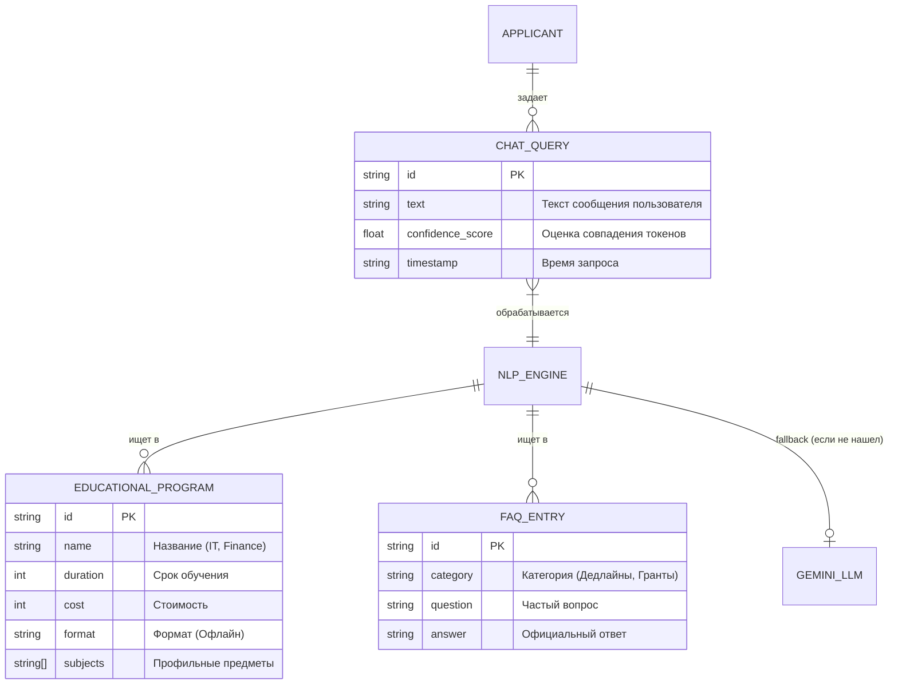

# Архитектура проекта и ERD (Smart University Admissions Assistant)

## 1. ER-Диаграмма (Модель данных)
Эта схема показывает, какие сущности существуют в системе и как они связаны. Основные данные хранятся в JSON файлах (`programs.json` и `faq.json`), к которым обращается NLP-движок.



## 2. Блок-схема логики (Архитектура гибридного чат-бота)
Эта схема описывает логику кода (`chatbot.py` и `api.py`). Она показывает, как работает алгоритм "Smart Fallback" — почему бот сначала пытается ответить сам, и только в крайнем случае обращается к платному API Gemini.

```mermaid
flowchart TD
    User([Абитуриент]) -->|Вводит вопрос| UI[Frontend: Vanilla JS / HTML]
    UI -->|POST /api/chat| API[Backend: FastAPI]
    
    API --> Tokenizer[Модуль NLP: Токенизация и лемматизация]
    
    Tokenizer -->|Поиск ключевых слов| DB[(Локальная база:\nprograms.json\nfaq.json)]
    DB -.->|Возвращает совпадения| Tokenizer
    
    Tokenizer --> Decision{Confidence Score >= 0.35?}
    
    Decision -->|Да (Уверенный ответ)| LocalAnswer[Локальный мгновенный ответ]
    Decision -->|Нет (Сложный вопрос)| Fallback[Вызов Google Gemini 3.6 API]
    
    Fallback -->|Генерация ответа ИИ\nна основе контекста базы| AIAnswer[Ответ ИИ с пометкой\n'Admissions Staff Offer']
    
    LocalAnswer --> Output[Сборка JSON ответа]
    AIAnswer --> Output
    
    Output -->|Возврат ответа| UI
    UI -->|Отображение на экране| User
    
    classDef ai fill:#ffe4e1,stroke:#ff6b6b,stroke-width:2px;
    class Fallback,AIAnswer ai;
    
    classDef local fill:#e1f7d5,stroke:#4caf50,stroke-width:2px;
    class Tokenizer,Decision,LocalAnswer local;
```
